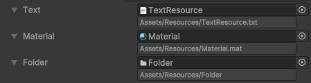
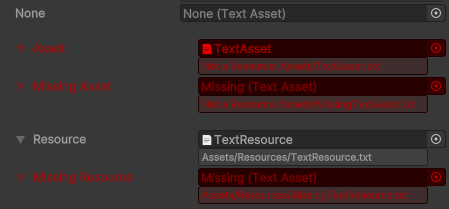

# Generic Resource Reference for Unity

This is a utility for Unity that provides a more efficient and seamless way of referencing Unity Resources. With this tool, you can bypass the manual text-based referencing with direct object references



```
using GenericResourceReference;
using UnityEngine;

public class Preview : MonoBehaviour {
    [SerializeField] ResourcePath<TextAsset> _text;
    [SerializeField] ResourceReference<Material> _material;
    [SerializeField] ResourceFolder _folder;

    void Start() {
        // ResourcePath only exposes the Path property
        var textResourcePath = _text.Path;
        
        // ResourceReference supports resource loading
        var material = _material.Load<Material>();
        
        // Folder loading is implemented by ResourceFolder
        var resources = _folder.LoadAll(); 
    }
}
```

---

## Features

- You can reference assets directly without preloading them
- Supports all resource types supported by Unity including folders and prefabs
- Support for resources in packages
- Three specialized classes:
  - `ResourcePath<>`/`ResourcePath` for only holding and exposing the path to any supported resource, including folders
  - `ResourceReference<>`/`ResourceReference` with methods for loading any non-folder resources
  - `ResourceFolder` with methods for loading the contents of any resource folders, including the`Resources` folder itself
- Minimal Runtime impact: the resource path string is simply wrapped into a serializable class, no other data stored
- Inspector displays the path of the asset, not just the resource path:

  

- Errors are visualized in Inspector:

  

- Loading behaves like `Resources.Load`:
  - returns `null` in case of error
  - doesn't spam to log
  - doesn't throw

- Provides interfaces like `IResourcePath`, `IResourceReference<TObject>`, and `IResourceFolder` for use with Dependency Injection.

---

## Limitations

1. This utility is not a replacement for Addressables, AssetBundles, StreamingAssets etc. It doesn't provide any caching or asset management mechanisms. If you require caching, you may need to implement it yourself or use [UnityResourceReference](https://github.com/paulhayes/UnityResourceReference) that has basic caching functionality.

2. Unity still has issues with generics within serializable collections or other generics, and this asset is no exception. If you need e.g. a `List<ResourcePath<Material>>` or an array, this will likely fail in build due to layout issues. Workarounds are to either use a non-generic `List<ResourcePath>`, or to create a non-generic subclass: `public class MaterialResourcePath : ResourcePath<Material> { }` and  `List<MaterialResourcePath>`.

---

## License

[MIT](LICENSE.md)

---

## Requirements

**Unity 2021.2.18f1 or newer**

Unity 6 is supported

Note: try [UnityResourceReference](https://github.com/paulhayes/UnityResourceReference) for older versions of Unity

---

## Installation

**As a GitHub package**

In the Package Manager UI, click on the `+` button, select `Add package from git URL...` and either enter `https://github.com/marked-one/GenericResourceReference.git` or use a version-specific format `https://github.com/marked-one/GenericResourceReference.git#1.0.0`


**As a local package**

Clone or download this repository, then in the Package Manager UI, click on the `+` button, select `Add package from disk...` and then target the `package.json` manifest file


**As an embedded package**

Clone or download this repository, name its folder `com.vladimirklubkov.genericresourcereference` and put it into `<Your Unity Project>/Packages`, so the path is `<Your Unity Project>/Packages/com.vladimirklubkov.genericresourcereference`

---

## Example

In the Package Manager UI, switch your view to `In Project` packages, find `Generic Resource Reference` and import the sample.

Open provided scene and run it in the Editor. Then add it to `Build Settings` and build to the desired platform to try it in Runtime.
